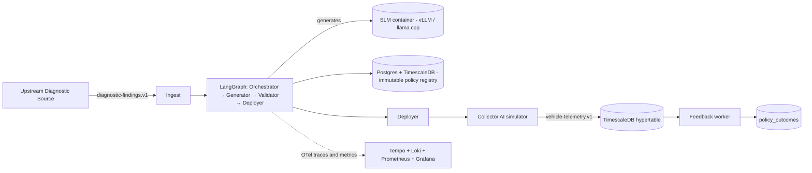

# CollectMind

[](.github/workflows/ci.yaml)
[](#)
[](LICENSE)

CollectMind is an autonomous policy engine that sits between an upstream diagnostic reasoning system (AI Technician) and a downstream vehicle telemetry control plane (Collector AI). When the diagnostic layer surfaces a hypothesis, CollectMind generates a typed `CollectionPolicySpec` with a self-hosted Small Language Model under schema-constrained decoding, validates it against COVESA VSS, persists it as an immutable, lineage-tagged record, deploys it, and (after the simulated collection window closes) writes an outcome record. Every operation is observable, paged on SLO breach, and gated by a tiered CI pipeline.

## Architecture



## Quickstart

Read the full feature-001 quickstart at [`specs/001-policy-loop-vertical-slice/quickstart.md`](specs/001-policy-loop-vertical-slice/quickstart.md). TL;DR for the foundation stack:

```bash
cp .env.example .env
docker compose -f infra/compose/docker-compose.yaml up -d
docker compose -f infra/compose/docker-compose.yaml exec orchestration-api curl -fsS http://localhost:8000/ready
```

## Documentation

- Spec, plan, research, data model, contracts, quickstart: [`specs/001-policy-loop-vertical-slice/`](specs/001-policy-loop-vertical-slice/)
- Architecture Decision Records: [`docs/adr/`](docs/adr/)
- Runbooks: [`docs/runbook/`](docs/runbook/)
- Threat model: [`docs/security/threat-model.md`](docs/security/threat-model.md)
- API reference (generated): [`docs/api/`](docs/api/)

## Constitution

The project constitution lives at [`.specify/memory/constitution.md`](.specify/memory/constitution.md). It is the highest-priority artifact and overrides any plan choice in conflict with it. Principles IV, VII, IX, X, XI, XIII, and XIV are non-negotiable.

## License

Apache-2.0. See [LICENSE](LICENSE).
