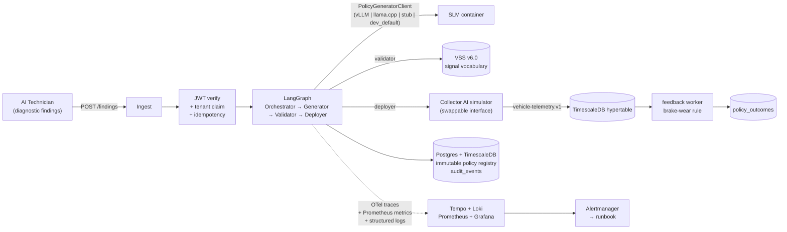

# CollectMind

[](.github/workflows/ci.yaml)
[](#)
[](LICENSE)

**CollectMind closes the diagnostic-to-collection loop that Sonatus's AI Technician and Collector AI products currently bridge manually.** When the diagnostic layer surfaces a hypothesis ("brake-wear early-stage anomaly on these three vehicles"), CollectMind generates a typed Collector AI policy with a self-hosted Small Language Model under schema-constrained decoding, validates it against the COVESA VSS v6.0 signal vocabulary, persists it as an immutable, lineage-tagged record, deploys it through the existing Collector AI API, and (after the simulated collection window closes) writes an outcome record that links back to the originating finding. Every operation is observable in a single Grafana dashboard, paged on SLO breach with a linked runbook entry, and gated by a tiered CI pipeline.

The system is multi-tenant from day one (composite finding key `(tenant_id, finding_id)`), audit-record-first (every policy generation, validation, deployment, outcome, and erasure produces an immutable audit row with the FR-017a minimum field set), and SLM-first (no frontier-LLM SaaS dependency in feature 001; the model boundary is swappable behind a `PolicyGeneratorClient` Protocol with four implementations).

## Architecture



## Quickstart

Full feature-001 quickstart: [`specs/001-policy-loop-vertical-slice/quickstart.md`](specs/001-policy-loop-vertical-slice/quickstart.md). Foundation-stack TL;DR:

```bash
cp .env.example .env
docker compose -f infra/compose/docker-compose.yaml up -d
until curl -fsS http://localhost:8081/ready >/dev/null 2>&1; do sleep 2; done && echo READY
```

Then publish a brake-wear diagnostic finding and observe the end-to-end loop (token mint → finding → policy → deployment → outcome → audit chain) per the quickstart's smoke-test sequence.

## Documentation

- **Session primer**: [`CLAUDE.md`](CLAUDE.md) — read first.
- **Current state**: [`docs/PROJECT_STATE.md`](docs/PROJECT_STATE.md) — phase status, commit SHAs, deferred items.
- **Decisions log**: [`docs/DECISIONS.md`](docs/DECISIONS.md) — process and pattern decisions outside the ADR cadence.
- **Spec-kit feature**: [`specs/001-policy-loop-vertical-slice/`](specs/001-policy-loop-vertical-slice/) — spec, plan, research, data model, contracts, quickstart, tasks, checklists.
- **Architecture Decision Records**: [`docs/adr/`](docs/adr/) — six ADRs (VSS pin, SLM selection, decoding library, stub, hosting topology, dev-only client).
- **Runbooks**: [`docs/runbook/`](docs/runbook/) and [`observability/runbooks/INDEX.md`](observability/runbooks/INDEX.md).
- **Threat model** (drafted in Phase 5): [`docs/security/threat-model.md`](docs/security/threat-model.md).
- **API reference** (generated on every build in Phase 5): [`docs/api/`](docs/api/).

## Constitution

The project constitution lives at [`.specify/memory/constitution.md`](.specify/memory/constitution.md) (v1.0.1). It is the highest-priority artifact and overrides any plan choice in conflict with it. **Principles IV, VII, IX, X, XI, XIII, and XIV are non-negotiable** (tests, CI/CD gates, security, vehicle telemetry data handling, performance SLOs, SLM-first model boundary, deterministic budgeted model execution in CI).

## License

[Apache-2.0](LICENSE).
